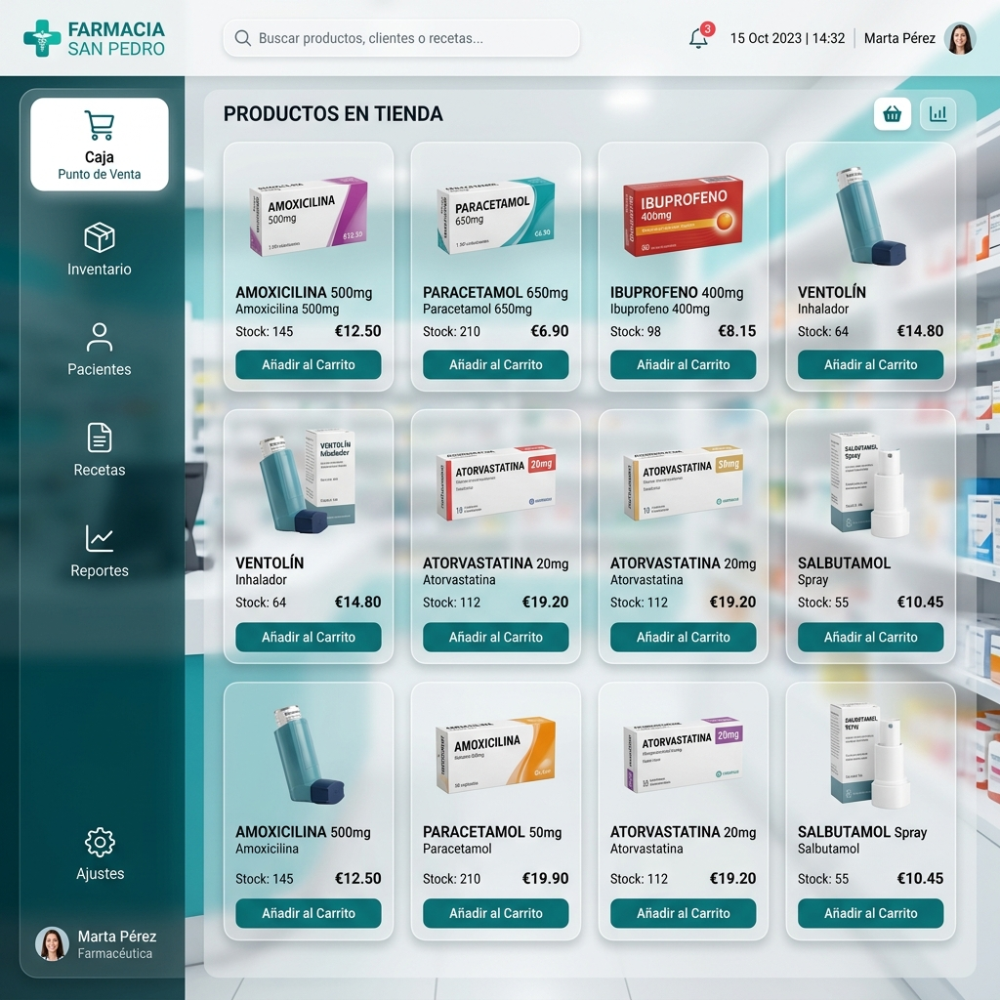

# 💊 FarmaPlus POS System

Sistema POS + Inventario en tiempo real para farmacia.

<p align="center">

<a href="https://farmaplus-pos-system.vercel.app">
  
</a>

<a href="https://farmaplus-pos-system.onrender.com">
  
</a>

</p>

> [!IMPORTANT]
> **Activación del Sistema:** Debido a que el Backend está alojado en la versión gratuita de Render, este puede "dormirse" tras un periodo de inactividad. 
> 
> **Si el Frontend aparece vacío:** Por favor, haz clic primero en el botón de **VER BACKEND** arriba. Una vez que veas el mensaje *"Nova Salud API Server is running"*, refresca el Frontend y todo funcionará perfectamente.

---

## 🧠 Tecnologías

- **Frontend:** React + Vite (Desplegado en Vercel)
- **Backend:** Node.js + Express (Desplegado en Render)
- **Base de Datos:** SQLite
- **Comunicación:** Socket.io (Sincronización en tiempo real)

---

## 📦 Arquitectura

```txt
Frontend (Vercel)
        ↓
Backend API (Render)
        ↓
SQLite Database
```

---

## ✨ Características

- **🛒 POS en tiempo real:** Ventas rápidas y fluidas.
- **📦 Inventario sincronizado:** Control total de stock y alertas.
- **📊 Dashboard administrativo:** Gestión de productos y ventas.
- **📈 Reportes:** Visualización de métricas clave.
- **🔐 Roles:** Acceso seguro para Administradores y Cajeros (JWT).
- **🛍️ Ecommerce:** Tienda virtual conectada al inventario real.

---

## 📸 Vista del sistema



---

## 👨‍💻 Autor
**Sebass277**
